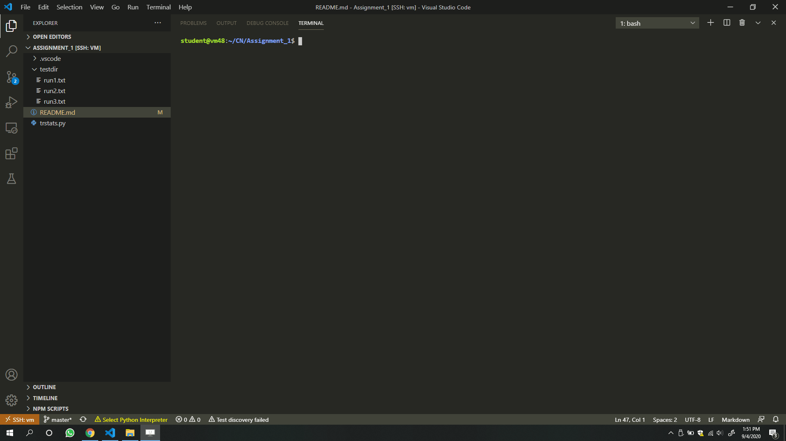
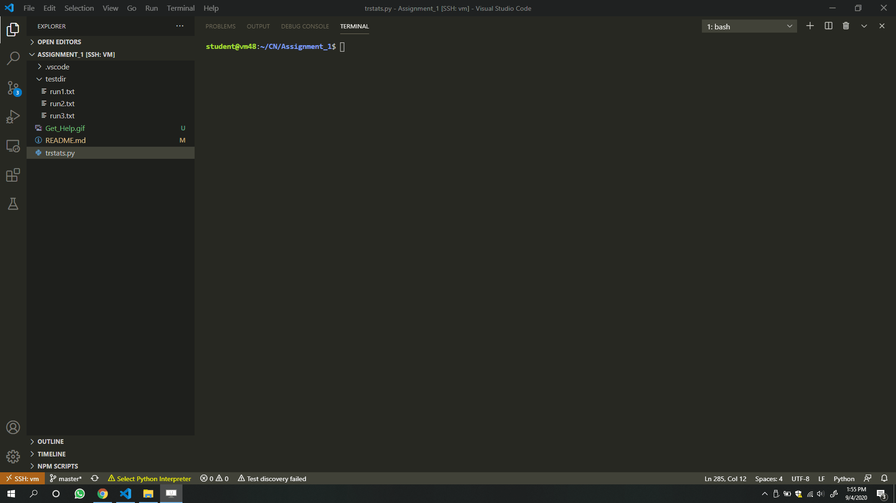
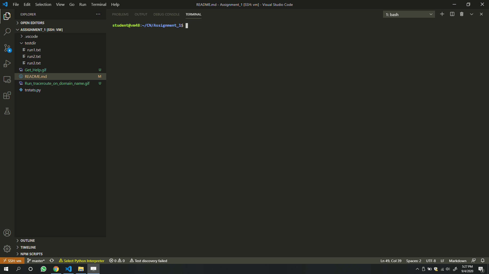

# Assignment_1
Use the traceroute  command to repeatedly measure the latency between your machine and a given server. Gather the latency
measurements provided by traceroute for each network hop. Compute simple statistics (min, med, avg, max) over the distribution of
latencies for each hop. Visualize the hop latency distributions using boxplots. Output the list of hosts/IPs and statistics for each hop using
a predefined JSON format.

# Programming Language/Framework used
###### Programming Language
Python 3.6
###### Framework
- Plotly
- Kaleido

# How to run
###### run the following command to get the help menu
> $python3 trastats.py -h

usage: trstats.py [-h] [-n NUM_RUNS] [-d RUN_DELAY] [-m MAX_HOPS] -o OUTPUT
                  [-t TARGET] [-test TEST_DIR]

RUN TRACEROUTE MULTIPLE TIMES TOWARDS A GIVEN TARGET HOST.

optional arguments:

  -h, --help      show this help message and exit

  -n NUM_RUNS     Number of times the traceroute will run

  -d RUN_DELAY    Number of seconds to wait between two consecutive runs

  -m MAX_HOPS     Maximum number of hops in one single traceroute run

  -o OUTPUT       path and name of output JSON and PDF file

  -t TARGET       A target domain name or IP address

  -test TEST_DIR  Directory containing num_runs text files, each of which
                  contains the output of a traceroute run. If present, this
                  will override all other options and traceroute will not be
                  invoked. Stats will be computed over the traceroute output
                  stored in the text files only.

# Examples:

To run traceroute on www.yahoo.com with num_runs = 2, delay=1 second, max_hops = 15, output = output, target = www.yahoo.com
> ./trstats.py -n 2 -d 1 -m 15 -o ouput -t www.yahoo.com

To run traceroute from a directory of text files containing the output of single traceroute run
> ./trstats.py -test testdir -o output

# Demo
How to get the help menu

Run tracerout on www.yahoo.com

Run tracerout from testfdir which contains traceroute output in text files
